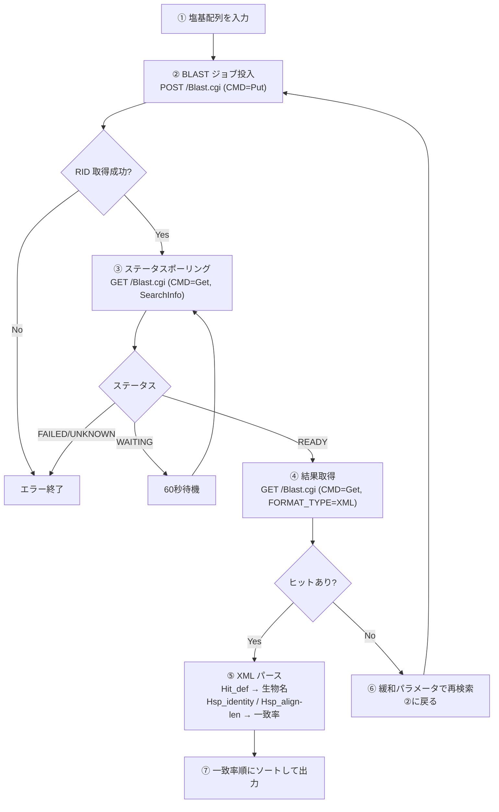

# 塩基配列から一致率・生物名を取得するプロセス

> NCBI BLAST REST API を用いて、任意の塩基配列から「一致率」と「生物名」を取得するまでの全工程をまとめる。

---

## 全体フロー



---

## 各ステップの詳細

### ① 塩基配列を入力

```
CGACGAATGCCTCGACGAATGGATCGACGAATGCCTCGACGAATGGAT...
```

任意の塩基配列（A, T, G, C の文字列）をクエリとして用意する。

---

### ② BLAST ジョブ投入

```
POST https://blast.ncbi.nlm.nih.gov/blast/Blast.cgi
```

| パラメータ | 値 | 説明 |
|:---|:---|:---|
| `CMD` | `Put` | ジョブ投入コマンド |
| `PROGRAM` | `blastn` | 塩基配列 vs 塩基配列 |
| `DATABASE` | `nt` | NCBI nucleotide collection |
| `QUERY` | *(配列文字列)* | 検索する塩基配列 |

サーバーは **RID**（Request ID）と **RTOE**（推定待ち時間）を返す:

```
RID = U7KZSP00014
RTOE = 30
```

---

### ③ ステータスポーリング

RID を使って検索の完了を待つ。RTOE 秒間待機した後、60 秒間隔でポーリングする。

```
GET https://blast.ncbi.nlm.nih.gov/blast/Blast.cgi
  ?CMD=Get&FORMAT_OBJECT=SearchInfo&RID=<RID>
```

| ステータス | 意味 | 対応 |
|:---|:---|:---|
| `WAITING` | 実行中 | 60 秒後に再確認 |
| `READY` | 完了 | 結果取得へ進む |
| `FAILED` | 失敗 | エラー処理 |
| `UNKNOWN` | 不明/期限切れ | エラー処理 |

---

### ④ 結果取得（XML）

```
GET https://blast.ncbi.nlm.nih.gov/blast/Blast.cgi
  ?CMD=Get&FORMAT_TYPE=XML&RID=<RID>
```

BLAST 結果を XML 形式で取得する。

---

### ⑤ XML パース — 一致率と生物名を抽出

返却されるXMLの構造:

```xml
<BlastOutput>
  <BlastOutput_iterations>
    <Iteration>
      <Iteration_hits>

        <Hit>                              ← 1つのヒット配列
          <Hit_def>Xantholinus longiventris genome assembly, chromosome: 5</Hit_def>
          <Hit_accession>OZ404939</Hit_accession>
          <Hit_len>38063004</Hit_len>
          <Hit_hsps>
            <Hsp>                           ← アラインメント情報
              <Hsp_identity>77</Hsp_identity>     ← 一致した塩基数
              <Hsp_align-len>92</Hsp_align-len>   ← アラインメント長
              <Hsp_evalue>4.75e-15</Hsp_evalue>
              <Hsp_qseq>GACGAATGCCTC...</Hsp_qseq>    ← クエリ配列
              <Hsp_hseq>GACGAATGGATG...</Hsp_hseq>    ← ヒット配列
              <Hsp_midline>||||||||  |...</Hsp_midline> ← 一致記号
            </Hsp>
          </Hit_hsps>
        </Hit>

      </Iteration_hits>
    </Iteration>
  </BlastOutput_iterations>
</BlastOutput>
```

**抽出対象のフィールド:**

| XML 要素 | 取得できる情報 | 例 |
|:---|:---|:---|
| `Hit_def` | **生物名**・配列の説明 | *Xantholinus longiventris* genome... |
| `Hit_accession` | アクセッション番号 | OZ404939 |
| `Hsp_identity` | 一致した塩基数 | 77 |
| `Hsp_align-len` | アラインメント長 | 92 |
| `Hsp_evalue` | E-value（統計的有意性） | 4.75e-15 |
| `Hsp_qseq` | クエリ側のアラインメント配列 | GACGAATGCCTC... |
| `Hsp_hseq` | ヒット側のアラインメント配列 | GACGAATGGATG... |

---

### ⑥ 緩和検索（通常検索で 0 件の場合）

通常の megablast ではヒットしない場合、以下のパラメータで再検索する:

| パラメータ | 通常 | 緩和 | 変更理由 |
|:---|:---:|:---:|:---|
| `MEGABLAST` | (yes) | **no** | megablast を無効化し感度を上げる |
| `WORD_SIZE` | 28 | **7** | シード検索を短くして弱い一致も検出 |
| `EXPECT` | 10 | **100000** | E-value 閾値を上げて弱い一致を許容 |
| `FILTER` | ON | **none** | 低複雑度マスキングを無効化 |
| `NUCL_PENALTY` | -3 | **-1** | ミスマッチのペナルティを軽減 |
| `NUCL_REWARD` | 1 | **1** | マッチの報酬 |

---

### ⑦ 一致率の計算とソート

```python
# 一致率 = 一致した塩基数 / アラインメント長 × 100
identity_pct = (Hsp_identity / Hsp_align-len) * 100

# カバレッジ = アラインメント長 / クエリ配列長 × 100
coverage = (Hsp_align-len / query_length) * 100
```

全ヒットを一致率の降順でソートし、最も高い一致率の配列を先頭に表示する。

---

## 出力例

```
★ 完全一致なし → 最も一致率の高い配列を表示します
  最高一致率: 83.7% (一致: 77/92bp, カバレッジ: 95.8%)

#    Accession          E-value      Score    一致率     カバレッジ   Description
---------------------------------------------------------------------------
1    OZ404939           4.76e-15     91.1     83.7%      95.8%      Xantholinus longiventris genome...
2    OZ409966           3.44e-14     88.3     82.6%      95.8%      Virgichneumon dumeticola genome...
3    OZ409967           9.27e-14     86.8     81.7%      96.9%      Virgichneumon dumeticola genome...

     Query:   GACGAATGCCTCGACGAATGGATCGACGAATGCCTCGACGAATGGAT...
     Match:   ||||||||  | ||||||||||| ||||||||  | ||||||||||||...
     Subject: GACGAATGGATGGACGAATGGATGGACGAATGGATGGACGAATGGAT...
```

---

## レート制限・利用ガイドライン

| ルール | 内容 |
|:---|:---|
| リクエスト間隔 | 10 秒以上空ける |
| ポーリング間隔 | 同一 RID に対して 60 秒以上空ける |
| 推奨パラメータ | `TOOL` と `EMAIL` を必ず指定する |
| 大量検索 | 50 件以上は平日夜間・週末に実行する |

---

## 参考

- [Entrez Programming Utilities Help](https://www.ncbi.nlm.nih.gov/books/NBK25501/)
- [BLAST URL API ドキュメント](https://blast.ncbi.nlm.nih.gov/doc/blast-help/urlapi.html)
- [BLAST Developer Info](https://blast.ncbi.nlm.nih.gov/doc/blast-help/developerinfo.html)
- 検証スクリプト: [`ncbi_api_test.py`](../scripts/ncbi_api_test.py)
